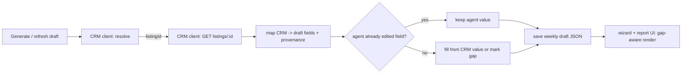

# feat: Weekly report consumes GEA_crmAI read API (Track 2)

## Summary

Wire this weekly-campaign-report app to pull its data from the **GEA_crmAI read
API** instead of being hand-keyed, and retire the app's direct VaultRE
integration. Property metadata, portal stats (REA/Domain split), and
inspection/open-home counts come from the CRM, **pre-fill** a weekly draft with
per-field provenance + freshness, and render **gap-aware** (a missing field shows
"needs entry", never a misleading zero). The agent reviews/overrides before
approval, and **agent edits always win** over CRM pre-fill.

This is the consumer half (Track 2). The producer half (CRM read API + ingestion)
is already built in GEA_crmAI (commit `c1e0b14`).

---

## Problem Frame

Today weekly reports are assembled by hand (manual wizard entry + markdown
fallback), so any single source leaves fields missing or stale. The CRM now
exposes a gap-aware read API that aggregates the sources; this app should consume
it (see origin: `docs/brainstorms/2026-06-16-multi-source-weekly-report-data-requirements.md`).

The CRM is the single source of truth; this app is a **pure read consumer** — it
does not write stats back (stat ingestion is owned entirely by the CRM).

---

## Live CRM Contract (verified 2026-06-19, GEA_crmAI)

Base URL: the CRM deployment (Railway). Auth: `Authorization: Bearer <token>`
where the token is the `weekly-report` consumer key. Both endpoints are
CORS-enabled (OPTIONS preflight) but this app will call them **server-side**.

- `GET /api/report/resolve?vaultId=<id>` or `?address=<text>` →
  `{ listingId, vaultExternalId }`. `400` if neither param, `404` on no match,
  `401` on bad token.
- `GET /api/report/listings/{listingId}` →
  - `listing`: `{ id, vaultExternalId, type, propertyAddress, suburb, postcode,
    state, propertyType, bedrooms, bathrooms, carSpaces, price, priceGuide,
    listedDate, daysOnMarket, agentName, vendorName, soldPrice, soldDate,
    ownerContactId }` (additive fields nullable).
  - `stats`: per-metric `{ value, source, capturedAt, gap }` — latest capture
    across all sources. Metrics = the CRM `CAMPAIGN_STAT_METRICS` vocabulary
    (views, enquiries, saves, searchAppearances, inspections, openHomes —
    confirm the exact constant at implementation time).
  - `statsByPortal`: `{ <source>: { <metric>: {value,source,capturedAt,gap} } }`
    — same shape split by source (e.g. `rea`, `domain`). Sources with no
    captures are absent.
  - **Gap semantics:** a captured value is `{ value, …, gap:false }` (a real
    entered zero is `value:0, gap:false`); a missing metric is
    `{ value:null, …, gap:true }`. This is the contract the UI keys off.

---

## Key Technical Decisions

- **KTD1 — Server-side consumption.** All CRM calls happen in this app's API
  routes / server code, not the browser, so the consumer token never ships to the
  client. (The CRM supports CORS, but we don't rely on it.)
- **KTD2 — CRM is pre-fill-only; agent edits win.** A CRM refresh only fills
  fields the agent has not manually set. Agent-entered values (including a
  deliberate zero) are never clobbered by a later CRM sync.
- **KTD3 — Carry provenance through the draft.** The weekly draft gains a
  per-field source/freshness/gap structure so the UI can show where each value
  came from and distinguish "no data" from a real zero (origin G2/G3).
- **KTD4 — REA/Domain from `statsByPortal`; combined counts from `stats`.**
  Portal-split fields (`reaViews`, `domainViews`, …) map from `statsByPortal`;
  open-home/inspection counts map from the combined `stats`.
- **KTD5 — Property keying by `vaultExternalId`, address fallback.** Resolve a
  CRM `listingId` via `vaultId` when the property has one, else `address`.
  Surface an unresolved property as a clear gap, not a silent skip.
- **KTD6 — Markdown stays as the local store + fallback.** Drafts continue to
  persist under `PROPERTIES_DIR/{slug}/weekly/`. CRM data flows *into* the draft;
  it does not replace the draft store. If the CRM is unreachable, generation
  degrades to today's behaviour (empty/gap fields) rather than failing.

---

## High-Level Technical Design

---

## Implementation Units

### U1. CRM client + config

**Goal:** A typed server-side client for the two CRM read endpoints with auth and
graceful failure.
**Requirements:** R1, KTD1, KTD5.
**Dependencies:** none.
**Files:** `src/lib/crm-client.ts` (new), `src/lib/crm-client.test.ts` (new),
`.env.example` (add `CRM_API_BASE_URL`, `WEEKLY_REPORT_API_TOKEN`), `.env.local`
(local values).
**Approach:** `resolveListing({ vaultId?, address? })` → `{ listingId,
vaultExternalId } | null`; `getReportListing(listingId)` → typed
`{ listing, stats, statsByPortal }`. Bearer auth from env. Timeouts + typed
errors; missing config or non-200 returns a typed failure the caller can degrade
on (KTD6), never throws to the request.
**Patterns to follow:** existing fetch wrapper style in `src/lib/minimax.ts`;
env-var access pattern in `src/lib/weekly-drafts.ts`.
**Test scenarios:**
- resolve with `vaultId` returns `{ listingId, vaultExternalId }` (happy path).
- resolve `404` → returns null (unresolved), not a throw.
- `getReportListing` maps a full payload incl. `statsByPortal`.
- `401` / missing token / missing base URL → typed failure, no throw.
- network timeout → typed failure.
**Verification:** client unit tests pass against mocked CRM responses; no token
reaches client bundles (server-only module).

### U2. Provenance-aware draft model

**Goal:** Extend the weekly draft to carry per-field `{ source, capturedAt, gap }`
and an "agent-edited" marker.
**Requirements:** R4, KTD2, KTD3.
**Dependencies:** none (can land before U3).
**Files:** `src/lib/types.ts` (extend `WeeklyDraft`), `src/lib/weekly-drafts.ts`
(persist/round-trip new fields), `src/lib/weekly-drafts.test.ts` (new/extended).
**Approach:** Add a `fieldSources: Record<string,{source,capturedAt,gap}>` map and
an `agentEdited: string[]` (field keys the agent has set). Backward-compatible:
older drafts without these load with empty defaults.
**Test scenarios:**
- save+load round-trips `fieldSources` and `agentEdited`.
- a legacy draft JSON (no new fields) loads with safe defaults.
- marking a field agent-edited persists across save/load.
**Verification:** existing draft load/save tests still pass; new fields persist.

### U3. CRM → draft mapping + pre-fill (agent edits win)

**Goal:** Map a CRM response into draft fields, filling only non-agent-edited
fields and recording provenance/gap.
**Requirements:** R2, R3, R5, R6, KTD2, KTD4.
**Dependencies:** U1, U2.
**Files:** `src/lib/crm-draft-mapper.ts` (new), `src/lib/crm-draft-mapper.test.ts`
(new).
**Approach:** Pure mapping function `applyCrmToDraft(draft, crmResponse)`:
`statsByPortal.rea/domain → rea*/domain*`; combined `stats.openHomes/inspections
→ openHomeAttendees/privateInspections`; listing fields → address/askingPrice
(`priceGuide`)/listingDate (`listedDate`)/daysOnMarket/agent/vendorName. For each
field: skip if in `agentEdited`; else set value (or leave null + `gap:true`) and
record `fieldSources`. Campaign-type mapping from `listing.type` is a deferred
detail (see Deferred).
**Test scenarios:**
- REA + Domain split values land in the right fields from `statsByPortal`.
- `gap:true` metric → field left unset, `fieldSources[field].gap === true`.
- a real `value:0, gap:false` → field set to 0, not treated as a gap.
- field in `agentEdited` → CRM value ignored, agent value preserved.
- missing `statsByPortal.domain` source → domain fields gap, REA still fill.
- unresolved listing (U1 returned null) → all CRM-sourced fields gap.
**Verification:** mapper unit tests cover happy/gap/zero/override/missing-source.

### U4. Wire generation + refresh to the CRM

**Goal:** Draft generation and an explicit refresh pull from the CRM via U1–U3.
**Requirements:** R1, R3, F1, KTD5, KTD6.
**Dependencies:** U1, U2, U3.
**Files:** `src/lib/weekly-drafts.ts` (`generateAllWeeklyDrafts` calls resolve+map
per property), `src/app/api/weekly-drafts/generate/route.ts`, new
`src/app/api/weekly-drafts/[id]/refresh/route.ts` (re-pull CRM for one draft),
`src/app/api/weekly-drafts/[id]/route.ts` (PATCH marks edited fields → `agentEdited`).
**Approach:** On generate, resolve each property (by `vaultExternalId` from
property data, else address) and apply CRM data. On PATCH from the wizard, add
changed fields to `agentEdited`. Refresh re-applies CRM without clobbering edited
fields. CRM failure → degrade to gap fields (KTD6), surface a non-fatal warning.
**Test scenarios:**
- generate fills a property's draft from CRM incl. provenance.
- property with no `vaultExternalId` resolves by address.
- unresolved property → draft created with gap fields, no crash.
- PATCH marks only changed fields edited; refresh preserves them.
- CRM down → generation still produces drafts (gap fields) + warning.
**Verification:** generate/refresh routes produce correct drafts against a mocked
CRM; failure path degrades gracefully.

### U5. Gap-aware UI (wizard + report)

**Goal:** Show provenance + freshness and distinguish gap vs zero in the agent UI.
**Requirements:** R3, R4, G2, G3.
**Dependencies:** U2 (model), U3/U4 for real data.
**Files:** `src/components/ReportWizard.tsx`, `src/components/StatCard.tsx`,
`src/app/report/[id]/page.tsx`, `src/components/vendor/` as needed.
**Approach:** Where a field has `gap:true`, render a "needs entry" affordance
instead of 0; where filled, show a small source/recency hint. Reuse the existing
`StatCard` trend-pill styling conventions. Vendor-facing portal keeps showing
clean numbers (gaps shown only in the agent wizard/review, not to vendors).
**Test scenarios:**
- field with `gap:true` renders "needs entry", not 0.
- field with `value:0, gap:false` renders 0 normally.
- filled field shows source/recency hint.
- vendor portal view does not show internal gap affordances.
**Verification:** wizard renders gap vs zero correctly for a mocked draft; vendor
view unaffected.

### U6. Retire direct VaultRE integration

**Goal:** Remove this app's VaultRE code and the Sync button.
**Requirements:** R8.
**Dependencies:** U4 (CRM path must be the working source first).
**Files (remove/modify):** delete `src/lib/vaultre.ts`,
`src/app/api/sync/vaultre/route.ts`, `src/components/SyncVaultREButton.tsx`;
remove `SyncVaultREButton` usage from the dashboard (`src/app/page.tsx`); drop
`VAULTRE_*` from `.env.example`/`.env.local`; update `CLAUDE.md` (project
structure + Monday workflow no longer references Sync).
**Approach:** Straight removal — the Sync button is deleted (not repurposed), per
decision. Confirm nothing else imports `vaultre.ts` before deleting.
**Test scenarios:** `Test expectation: none -- pure removal; covered by build +
existing suite passing with no dangling imports.`
**Verification:** app builds, no references to removed modules, dashboard renders
without the Sync button.

---

## Scope Boundaries

### In scope
- CRM client, provenance-aware draft model, CRM→draft mapping, generation/refresh
  wiring, gap-aware agent UI, removal of direct VaultRE.

### Deferred to Follow-Up Work
- **Campaign-type mapping** from `listing.type`/sale process to the report's
  `campaignType` label — small, do during U3 if obvious, else follow-up.
- **Vendor-facing freshness display** — showing "as at <date>" to vendors.
- **`soldPrice`/`soldDate`** surfacing (sold-campaign reports).

### Outside this product's identity
- Writing stats back to the CRM (CRM owns all ingestion).
- Any direct VaultRE/portal integration in this app.

---

## Dependencies & Assumptions

- **D1** CRM endpoints `/api/report/resolve` and `/api/report/listings/{id}` are
  live (verified 2026-06-19). The `weekly-report` consumer token must be issued
  and set as `WEEKLY_REPORT_API_TOKEN` here, and `CRM_API_BASE_URL` pointed at the
  CRM deployment.
- **D2 (runtime, not code-blocking)** Real stat/inspection data depends on the CRM
  having run VaultRE sync + stat ingestion. Until then, fields come back
  `gap:true` — which this plan handles gracefully. The consumer can be built and
  tested against mocked responses regardless.
- **A1** Property records here carry (or can derive) a `vaultExternalId` or a
  resolvable address for KTD5. Where neither resolves, the property shows gaps.

---

## Risks

- **Contract drift** — if the CRM changes the `{value,source,capturedAt,gap}` or
  `statsByPortal` shape, mapping breaks. Mitigate: type the client (U1) and fail
  gracefully (KTD6); the CRM plan flagged this contract as stable.
- **Pre-fill clobbering edits** — the central correctness risk; covered by the
  `agentEdited` tests in U3/U4.
- **Token exposure** — mitigated by server-side-only consumption (KTD1).
