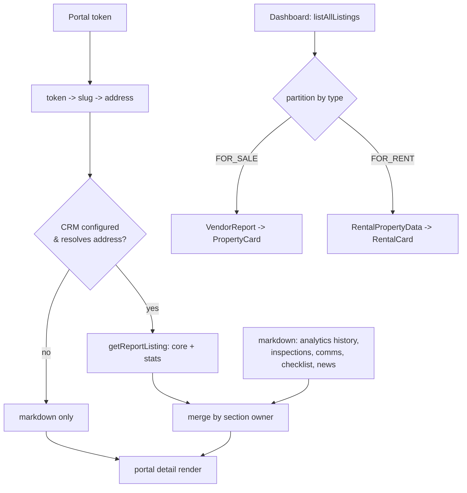

# feat: Sales + rental listings and portal detail from CRM, supplemented by iCloud markdown

## Summary

Make the agent dashboard and the token-gated portal detail pages source their
**listing set and core data from the GEA_crmAI read API** — for **both sales and
rentals** — while **iCloud markdown supplements** the sections the CRM does not
hold (analytics history, inspections, communications, checklist, market news).
This extends the already-built Track 2 consumer (drafts/wizard, see origin) and
the dashboard sales-listing slice landed 2026-06-23, so the app renders real data
on Railway where the local markdown dir is absent.

CRM is the source for the listing set, core metadata, and portal stats; iCloud
markdown is the source for the rich portal sections. Each portal section has one
clear owner (no per-field merge). This app stays a **pure read consumer**.

---

## Problem Frame

The app reads listings from markdown files in the user's iCloud folder
(`GEA_vendor_portal/`), which is outside the repo and absent on Railway — so
production showed no listings (and new listings like "36 Mitre" never appeared).
The dashboard sales path now reads from the CRM; rentals still come from markdown,
and the **portal detail pages** (`/vendor/[token]`, `/landlord/[token]`) are still
markdown-only, so a vendor/landlord link 404s on Railway.

The CRM holds the authoritative listing set + stats but not the richer narrative
content (comms log, inspection history, weekly analytics tables, checklist, news),
which lives in iCloud markdown. The fix is a **two-source read**: CRM for the set
+ core + stats, markdown for the rich sections, keyed together per listing
(see origin: `docs/brainstorms/2026-06-16-multi-source-weekly-report-data-requirements.md`).

---

## Current State (verified 2026-06-23)

- `GET /api/report/listings` (built this session in GEA_crmAI) returns **all
  active listings** — `type IN (FOR_SALE, FOR_RENT)` with no `soldDate` — so
  rentals are already included; the consumer just needs to partition by `type`.
- Consumer dashboard (`src/app/page.tsx`) calls `listAllListings()` and maps
  **every** result through `crmReportToVendorReport` → rentals currently render
  as sales cards (bug this plan fixes).
- Rentals dashboard + `/landlord/[token]` read markdown only (`getAllRentals`,
  `getRental(slug)` in `src/lib/rental-loader.ts`).
- `/vendor/[token]` reads markdown only (`getProperty(slug)` keyed by
  `getPropertySlugForToken(token)`).
- CRM client (`src/lib/crm-client.ts`) has `resolveListing({address})`,
  `getReportListing(id)`, `listAllListings()`, `isCrmConfigured()`.
- CRM `CAMPAIGN_STAT_METRICS` = views, enquiries, saves, searchAppearances,
  inspections, openHomes, shortlists, qualifiedBuyers, competingBidders —
  **no `applications`** metric (rental-specific) → that field stays markdown/0.

---

## Key Technical Decisions

- **KTD1 — Token resolves to a CRM listing by address.** `token → slug` (existing
  JSON store) `→ property/rental address → resolveListing({ address }) → listingId
  → getReportListing(listingId)`. Reuses the existing resolver and token stores;
  no new id mapping to maintain or backfill. Accepts a dependency on address-text
  matching; an unresolved address degrades to markdown-only (KTD4).
- **KTD2 — One owner per portal section, CRM-first for what it owns.** CRM owns:
  listing metadata (address, price guide, agent, vendor/landlord name, listed
  date, days on market) and portal **stats** (views/enquiries/saves +
  REA/Domain split). Markdown owns: weekly analytics history, inspection history,
  communications log, checklist, market news, latest update. No per-field merge
  across owners — avoids the blurred-ownership cost.
- **KTD3 — Listing type drives sales vs rental routing.** Partition
  `listAllListings()` by `listing.type`: `FOR_SALE → VendorReport`/PropertyCard,
  `FOR_RENT → RentalPropertyData`/RentalCard. Keeps one CRM round-trip for the
  whole dashboard.
- **KTD4 — Markdown is the supplement and the fallback.** When the CRM is
  unreachable/unconfigured or a listing doesn't resolve, the page renders from
  markdown alone (today's behaviour). When markdown is absent (Railway) and the
  CRM resolves, the page renders CRM core+stats with empty rich sections rather
  than 404. Both degradations are graceful, never a crash.
- **KTD5 — Vendor-facing pages show clean numbers, not gaps.** Per the prior
  plan's U5, gap affordances are agent-only. On portal detail, a CRM `gap:true`
  stat falls back to the markdown value if present, else renders 0/empty — never
  a "needs entry" affordance to the vendor/landlord.
- **KTD6 — `applications` (rentals) is markdown-sourced.** Not in the CRM metric
  vocabulary; the landlord view continues to read it from the markdown analytics
  row (or 0 when absent).

---

## High-Level Technical Design

---

## Implementation Units

### U1. Partition CRM listings by type on the dashboard

**Goal:** The dashboard renders CRM `FOR_SALE` as sales cards and `FOR_RENT` as
rental cards, from a single `listAllListings()` call — fixing rentals currently
showing as sales cards.
**Requirements:** R1, R2; KTD3. Advances origin G1.
**Dependencies:** U2 (rental mapper).
**Files:** `src/app/page.tsx`, `src/lib/crm-report-to-report.ts` (add a
`listingType` helper/export if needed), `src/app/page.test.tsx` or
`src/lib/crm-report-to-report.test.ts` (new) for the partition logic.
**Approach:** After `listAllListings()`, split `data` by `listing.type`. Map
`FOR_SALE` via existing `crmReportToVendorReport`; map `FOR_RENT` via the new
`crmReportToRental` (U2). Keep the CRM-first → markdown → mock layering for the
sales set; apply the same layering to rentals (CRM rentals, else `getAllRentals`,
else none). The aggregate metric strip counts sales listings as today.
**Patterns to follow:** the existing layered-source block in `src/app/page.tsx`
(CRM-first → markdown → mock) added this session.
**Test scenarios:**
- mixed CRM payload (2 FOR_SALE, 1 FOR_RENT) → 2 sales reports, 1 rental card.
- all FOR_SALE → rentals fall back to markdown (or empty), no rental from CRM.
- CRM unconfigured → both sets fall back to markdown (regression guard).
- Covers AE1. a FOR_SALE listing with stats renders a sales card with views/enquiries.
**Verification:** dashboard shows sales and rentals in their correct sections from
a mocked CRM payload; sales-only and unconfigured paths still render.

### U2. Map a CRM rental listing to the rental card/portal shape

**Goal:** A pure mapper from a CRM `ReportListing` (type `FOR_RENT`) to the
`RentalPropertyData` shape the dashboard `RentalCard` and landlord portal use.
**Requirements:** R2, R3; KTD2, KTD6.
**Dependencies:** none.
**Files:** `src/lib/crm-report-to-rental.ts` (new),
`src/lib/crm-report-to-rental.test.ts` (new).
**Approach:** `crmReportToRental(report): RentalPropertyData`. Map
`address, landlord (vendorName), agent (agentName), rentPw (priceGuide),
leaseType (type label), listed (listedDate)`. Synthesize a single
`analytics[0]` row from CRM stats: `reaViews/domainViews` from `statsByPortal`,
combined `enquiries`; `applications` left 0 (KTD6, not a CRM metric). Rich
fields the CRM doesn't own (`checklist, inspections, communications, news,
latestUpdate`) default empty — they are filled from markdown only on the portal
detail page (U5), not on the card. Reuse the portal field-name maps exported from
`src/lib/crm-draft-mapper.ts` where they apply.
**Patterns to follow:** `src/lib/crm-report-to-report.ts` (sibling sales mapper).
**Test scenarios:**
- maps core rental fields (rent, landlord, agent, lease type) from the listing.
- `statsByPortal` rea/domain views land in the synthesized analytics row.
- `gap:true` stat → 0 in the card row (vendor-facing, KTD5), not null.
- `applications` is 0 (no CRM metric) regardless of stats payload.
**Verification:** mapper unit tests cover core fields, stats synthesis, gap→0, and
the applications carve-out.

### U3. Shared "resolve token to CRM listing by address" helper

**Goal:** One server-side helper that turns a portal token (or address) into a
CRM `ReportListing | null`, used by both portal detail pages.
**Requirements:** R1; KTD1, KTD4.
**Dependencies:** none (CRM client already exists).
**Files:** `src/lib/crm-portal.ts` (new), `src/lib/crm-portal.test.ts` (new).
**Approach:** `getCrmListingForAddress(address): Promise<ReportListing | null>` —
if `!isCrmConfigured()` return null; `resolveListing({ address })`; on
`ok && data` call `getReportListing(listingId)`; return its data or null. Never
throws (mirrors `crm-client` graceful-failure contract, KTD4). Keep token→slug and
slug→address resolution in the page (it differs for sales vs rental loaders); this
helper takes the address string.
**Patterns to follow:** `enrichDraftFromCrm` in `src/lib/weekly-drafts.ts`
(resolve-then-fetch sequence).
**Test scenarios:**
- configured + address resolves → returns `ReportListing`.
- address 404 (unresolved) → null, no throw.
- CRM unconfigured → null without calling the network.
- resolve ok but listing fetch fails → null, no throw.
**Verification:** helper unit tests cover resolve hit, miss, unconfigured, and
fetch-failure — all non-throwing.

### U4. Vendor portal detail: CRM core+stats over markdown rich

**Goal:** `/vendor/[token]` shows CRM-sourced core metadata + portal stats with
markdown supplying analytics history, inspections, comms, checklist, news; renders
on Railway (markdown absent) without 404 when the CRM resolves.
**Requirements:** R2, R3, F3; KTD2, KTD4, KTD5. Advances origin G1.
**Dependencies:** U3.
**Files:** `src/app/vendor/[token]/page.tsx`,
`src/lib/data-adapter.ts` (a merge helper, e.g. `mergeCrmIntoProperty(property,
crmListing)`), `src/lib/data-adapter.test.ts` (new/extended).
**Approach:** Resolve `token → slug` (existing), load markdown via
`getProperty(slug)` (may be null on Railway), resolve CRM via
`getCrmListingForAddress(property?.address ?? <address from token meta>)`. Build
the view model: **CRM wins** for price guide, agent, vendor name, listed date,
days on market, and the portal stat totals/splits (when not gap, KTD5); markdown
supplies inspection history, communications, weekly analytics history, checklist,
market news, latest update. If markdown is null, render CRM core+stats with empty
rich sections; if CRM is null, render markdown alone (today). 404 only when both
are null.
**Patterns to follow:** existing server-component data load at the top of
`src/app/vendor/[token]/page.tsx`; the print/section structure stays unchanged.
**Test scenarios:**
- markdown + CRM present → stats/price from CRM, comms/inspections from markdown.
- CRM gap stat + markdown value present → markdown value shown (KTD5), not 0.
- markdown null (Railway) + CRM resolves → page renders, rich sections empty.
- both null → 404.
- Covers AE4. an agent-overridden value persisted in the draft/markdown is what shows (no CRM clobber on the vendor view).
**Verification:** vendor page renders correct merged data for each source
combination against mocked CRM + markdown; 404 only when both missing.

### U5. Landlord portal detail: CRM core+stats over markdown rich

**Goal:** `/landlord/[token]` mirrors U4 for rentals — CRM core + rental stats,
markdown for the rich sections; `applications` from markdown (KTD6).
**Requirements:** R2, R3, F3; KTD2, KTD4, KTD5, KTD6.
**Dependencies:** U2, U3.
**Files:** `src/app/landlord/[token]/page.tsx`,
`src/lib/rental-loader.ts` (a merge helper, e.g. `mergeCrmIntoRental(rental,
crmListing)`), `src/lib/rental-loader.test.ts` (new/extended).
**Approach:** Resolve `token → slug` (`getRentalSlugForToken`), load markdown via
`getRental(slug)` (may be null), resolve CRM via
`getCrmListingForAddress(rental?.address)`. CRM wins for rent (price guide),
agent, landlord (vendor) name, lease type, listed date, days listed, and portal
stat totals; markdown supplies analytics history, inspections, comms, checklist,
news, latest update, and `applications`. Same null-handling as U4 (404 only when
both null).
**Patterns to follow:** U4's merge helper and the existing landlord page load.
**Test scenarios:**
- markdown + CRM present → rent/agent from CRM, comms/inspections from markdown.
- `applications` always from markdown analytics (0 when markdown absent), KTD6.
- markdown null + CRM resolves → renders with empty rich sections.
- both null → 404.
**Verification:** landlord page renders correct merged data for each source
combination; applications never sourced from CRM.

### U6. Config, env docs, and end-to-end verification

**Goal:** Document required env and verify the two-source read end-to-end against
the live CRM.
**Requirements:** D1; KTD4.
**Dependencies:** U1, U4, U5.
**Files:** `.env.example` (confirm `CRM_API_BASE_URL`, `WEEKLY_REPORT_API_TOKEN`),
`CLAUDE.md` (update data-source notes: dashboard + portals are CRM-first,
markdown-supplemented), `docs/plans/2026-06-23-001-...-plan.md` (this file,
verification log).
**Approach:** No code logic; ensure env is documented for local + Railway. Run the
verification below. Note the known follow-up that markdown writes (drafts) are not
persisted on Railway.
**Test scenarios:** `Test expectation: none -- docs/config only; covered by the
end-to-end verification below.`
**Verification:** see Verification section.

---

## Scope Boundaries

### In scope
- Dashboard rentals from the CRM (type partition) + sales already done.
- CRM→rental mapper; shared token→CRM-by-address resolver.
- Vendor and landlord portal detail pages: CRM core+stats merged over markdown
  rich sections, with graceful degradation both ways.

### Deferred to Follow-Up Work
- Persisting weekly drafts / agent edits on Railway (volume or CRM-backed draft
  store) — markdown writes are still local/ephemeral on the host.
- Surfacing a rental `applications` metric in the CRM (producer-side metric
  vocabulary change) so it stops being markdown-only.
- Vendor-facing freshness ("as at <date>") display.

### Outside this product's identity
- Writing stats back to the CRM (CRM owns all ingestion — origin).
- Any direct VaultRE/portal integration in this app (origin R8; already retired).

---

## Dependencies & Assumptions

- **D1** CRM live with `/api/report/listings`, `/api/report/resolve`,
  `/api/report/listings/{id}`; `CRM_API_BASE_URL` + `WEEKLY_REPORT_API_TOKEN` set
  locally and on Railway. (`/api/report/listings` shipped this session; confirm it
  is deployed to the CRM host.)
- **A1** Markdown property/rental `address` text matches the CRM
  `propertyAddress` closely enough for `resolveListing({ address })` to hit. Where
  it doesn't, the page degrades to markdown-only (KTD4) — acceptable.
- **A2** On Railway, markdown is absent; portal pages rely on the CRM for core +
  stats and render empty rich sections until a persistent store exists (deferred).

---

## Risks

- **Address-match misses** — a slightly different address string yields a CRM
  404 and a markdown-only render. Mitigate: KTD4 degradation; log unresolved
  addresses for the agent to reconcile; the listingId-in-token-map option remains
  a future hardening if misses are common.
- **Two-source confusion** — unclear which source supplied a value. Mitigate:
  KTD2's one-owner-per-section rule keeps ownership legible; no per-field merge.
- **CRM contract drift** — same as the prior plan; the typed client (`crm-client`)
  and graceful failure contain it.
- **Rentals rendering regression** — until U1 lands, CRM rentals show as sales
  cards. U1 is sequenced first among the dashboard changes and guarded by the
  partition tests.

---

## Verification

1. **Unit:** `npx tsc --noEmit` clean (ignore the stale `.next` vaultre type);
   new mapper/helper/merge tests pass (`crm-report-to-rental`, `crm-portal`,
   `data-adapter`, `rental-loader`).
2. **Local dashboard:** with CRM env set, dashboard shows sales **and** rentals
   from the CRM in their correct sections; with CRM env unset, both fall back to
   markdown (4 local listings).
3. **Local portals:** `/vendor/<token>` and `/landlord/<token>` show CRM price/
   agent/stats with markdown comms/inspections/history; temporarily blanking the
   markdown dir still renders core+stats (no 404) when the CRM resolves.
4. **Live CRM:** `curl -H "Authorization: Bearer <token>"
   https://<crm>/api/report/listings` returns both FOR_SALE and FOR_RENT incl.
   36 Mitre; `resolve?address=<36 Mitre address>` returns a listingId.
5. **Prod:** after Railway env is set + redeploy, prod root and a vendor/landlord
   token URL return 200 with real data.
