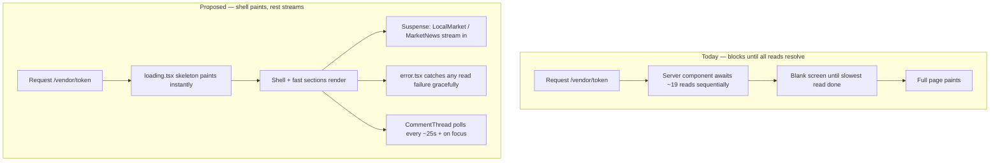
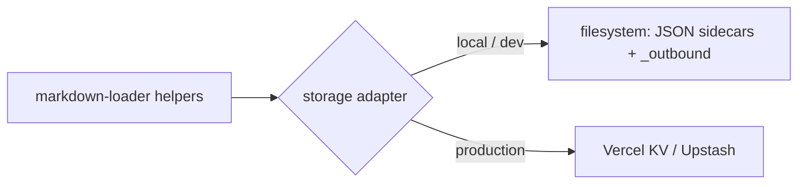

# feat: Vendor Portal UX Enhancements + Backend Reliability

**Target repo:** `GEA_ST_reports_weeklycampaign_vendor` (Next.js 16 / React 19 app). Markdown + JSON data lives in `GEA_ST_vendor_portal/properties/{slug}/`, path set by `PROPERTIES_DIR`.

## Summary

The portal is functionally complete and, after the 30 Jun 2026 hardening pass, builds clean (40 routes), lints clean, and passes 40 tests. This plan targets the next tier: **reduce vendor friction** (blank hangs on slow loads, stale message threads, no empty states) and **enhance satisfaction** (perceived speed via streaming, clearer hierarchy), then **close the reliability gaps** that block a real production deploy (unauthenticated ingest, Vercel's read-only filesystem, untested core parsers).

It does **not** redesign the public marketing site or re-open product scope — the vendor dashboard's information architecture is treated as sound; this is friction removal and hardening, not a rebuild.

---

## Implementation Status (1 Jul 2026)

All eight units built and verified. Gate: **lint 0 · 59 tests (+19) · build compiles · runtime-smoke passed.**

- **U1** — partial: `error.tsx` shipped; route-level `loading.tsx` skeleton dropped (it downgraded invalid-token 404s to streamed 200s — see U1 note). Per-section streaming delivered via U4.
- **U2** — done: `EmptyState` wired into `UpcomingOpens` + `WeeklyTrend`; verified live on a data-less property.
- **U3** — done: `CommentThread` polls (25s) + refetches on focus, merge-by-id preserves in-flight sends.
- **U4** — done: `LocalMarket` wrapped in `<Suspense>`.
- **U5** — done: parsers exported + 10 characterisation tests (behaviour-preserving; pre-existing tests unchanged).
- **U6** — done, scope-adjusted: 3 machine ingest routes gated by `INGEST_API_KEY` (fail-closed in prod, 401/503 verified); `properties/create` **excluded** — it's browser-admin-called and can't hold a secret, so it needs a separate `/admin` auth effort (flagged below).
- **U7** — partial: storage seam + fs driver extracted and tested for byte-parity; sidecar round-trip verified live. KV driver **stubbed** (throws actionable error) — needs `@vercel/kv` + a live instance to implement. `_outbound` queue stays on FS (needs the dispatcher redesign, already noted in System-Wide Impact).
- **U8** — verified, no fix needed: manifest, theme-colour, iOS standalone meta, maskable icons, and SW (network-first pages / cache-first static / offline fallback) all already correct; message send target already ≥44px.

**New follow-ups surfaced during build:** (a) implement the KV driver when Vercel infra exists; (b) gate the `/admin` surface (incl. `properties/create` + `/api/vendor/tokens`) behind admin auth; (c) redesign the `_outbound` queue + Python dispatcher for KV before prod.

---

## Problem Frame

Vendors open one token-authenticated page (`/vendor/{token}`) that server-renders ~19 async sections (live stats, trend chart, activity feed, messages, inspections, documents, local market, guides). Three concrete friction sources exist today, all verified in code:

1. **No loading or error boundary** on the vendor route — only `not-found.tsx` exists. The page awaits many sequential reads (`getLiveStats`, `readOpens`, analytics, external market lookups) before painting anything, so a slow read shows a blank screen, and a thrown read shows the default Next error page.
2. **Messages don't live-update** — `CommentThread.tsx` sends optimistically but never polls, so a vendor never sees the agent's reply until they manually refresh. This makes the "two-way messaging" feature feel broken.
3. **Silent empty states** — components like `UpcomingOpens` and `WeeklyTrend` `return null` when they have no data, so a new listing shows blank gaps with no explanation of what will appear there.

Separately, three reliability gaps block production and were deferred from the hardening pass:

4. `/api/ingest/analytics`, `/api/ingest/inspection`, `/api/ingest/telegram`, and `/api/properties/create` are **unauthenticated** (path traversal is closed, but anyone can still write to a valid property).
5. **Vercel's filesystem is read-only** — the JSON sidecar writes (`activity.json`, `comments.json`) and the `_outbound` notification queue assume a writable disk + cron host. They will fail in production.
6. The **core markdown parsers are untestable** — `parseMarkdownTable` and the analytics/inspection/comms/offers parsers are module-private in `markdown-loader.ts`, so the logic most likely to break on malformed input has zero coverage.

---

## Requirements

| ID | Requirement | Advanced by |
|----|-------------|-------------|
| R1 | Vendor never sees a blank screen or raw error page while data loads or on a read failure | U1 |
| R2 | New/empty sections explain what will appear rather than rendering nothing | U2 |
| R3 | A vendor sees agent replies without manually refreshing | U3 |
| R4 | The page shell paints fast; slow/external sections stream in without blocking | U4 |
| R5 | Core parsing logic is covered by unit tests against real and malformed input | U5 |
| R6 | Ingest + property-create endpoints reject unauthenticated writes | U6 |
| R7 | Sidecar + notification writes work on a read-only (Vercel) filesystem | U7 |
| R8 | Mobile ergonomics and PWA install/offline shell verified | U8 |

---

## Key Technical Decisions

- **Use Next.js route segment conventions for R1**, not in-component spinners: a `loading.tsx` skeleton and an `error.tsx` boundary in `src/app/vendor/[token]/`. This is the platform-native mechanism (React Suspense + error boundary), needs no new dependency, and covers every child section at once.
- **Stream slow sections with `<Suspense>` (R4)** rather than converting the page to client-side fetching. The page stays a Server Component; only the genuinely slow/external sections (`LocalMarket`, `MarketNews`, and anything hitting an external API) get wrapped so the static shell + fast sections paint immediately.
- **Poll for messages on an interval + on window focus (R3)**, not websockets. A 20–30s `setInterval` plus a `visibilitychange` refetch in `CommentThread` is dependency-free, fits a low-message-volume use case, and avoids standing up a realtime server. Live websockets are noted as a Deep-roadmap follow-up, not built here.
- **Export parsers for testing (R5)** rather than mocking `fs`. Promote the pure parser helpers from module-private to exported, keeping file-reading wrappers separate. Tests hit the pure functions with string fixtures — no filesystem, no mocks.
- **Shared ingest secret for R6**, reusing the `agent-auth.ts` pattern from the hardening pass (constant-time compare, fail-closed when unset in production). This keeps one auth mechanism across agent + ingest routes. Requires the Open Claw / CRM caller to send the header — coordinated via the CRM handoff, not assumed.
- **Vercel KV (Upstash Redis) for R7**, behind a storage adapter. Introduce a thin `storage.ts` seam so `readActivity/appendActivity/readComments/appendComment` and `enqueueNotification` call an interface, with a filesystem implementation (local/dev) and a KV implementation (prod). Avoids rewriting every call site and keeps local dev on plain files.

---

## High-Level Technical Design

Current vs. proposed render/data flow for the vendor route:

Storage seam for R7 (one interface, two implementations):

---

## Scope Boundaries

**In scope:** vendor-route loading/error boundaries, empty states, message polling, Suspense streaming of slow sections, parser test coverage, ingest auth, the KV storage adapter, a mobile/PWA verification pass.

### Deferred to Follow-Up Work
- Websocket / SSE realtime activity + messages (this plan uses polling).
- Web-push notifications to the PWA.
- Full offline read support beyond the app-shell.
- Any redesign of the public marketing pages or admin console.

### Outside this plan
- Reworking the dashboard's section set or product IA — treated as sound.
- CRM-side changes to send the new ingest secret (owned by the CRM project; this plan only defines the portal contract).

---

## Implementation Units

### U1. Vendor route loading + error boundaries

> **Implemented 1 Jul 2026 — partial.** `error.tsx` shipped (branded, retry, no token/stack leak). A route-level `loading.tsx` skeleton was **dropped**: it flushes the streaming shell before the page can call `notFound()`, which downgrades an invalid token from a proper `404` to a streamed `200`. Correct 404 status + branded not-found beat a route-level skeleton for direct-link hard loads of fast local reads. Route-level skeleton is deferred until token validation can run in a parent segment (so it can 404 before streaming). Per-section streaming still delivered via U4's `<Suspense>` around `LocalMarket`. `SectionSkeleton` retained as the Suspense fallback.

**Goal:** No blank screen while data loads; no raw error page on a read failure.
**Requirements:** R1
**Dependencies:** none
**Files:**
- `src/app/vendor/[token]/loading.tsx` (create)
- `src/app/vendor/[token]/error.tsx` (create — must be a Client Component)
- `src/components/vendor/DashboardSkeleton.tsx` (create — reusable skeleton blocks)
**Approach:** `loading.tsx` renders a skeleton mirroring the real section rhythm (header, stat tiles, trend block, message panel) using the existing design tokens (`--card-bg`, `--surface`, radii). `error.tsx` shows a warm, on-brand "we couldn't load your dashboard just now" with a retry button (`reset()`), never a stack trace. Keep the vendor's token out of any visible error text.
**Patterns to follow:** existing `not-found.tsx` in the same folder for tone; `SectionHeading`/design tokens in `globals.css`.
**Test scenarios:**
- Loading skeleton renders without throwing when no data is present (component render test).
- Error boundary renders the friendly message + working retry when a child throws (simulate a thrown child).
- Error text contains no token, slug, or stack content.
**Verification:** Throttle a read (temporary delay) → skeleton shows, then real content replaces it; force a read to throw → friendly error + retry recovers.

### U2. Empty states for data-less sections

**Goal:** New listings explain what will appear instead of showing blank gaps.
**Requirements:** R2
**Dependencies:** none
**Files:**
- `src/components/vendor/UpcomingOpens.tsx` (modify)
- `src/components/vendor/WeeklyTrend.tsx` (modify)
- `src/components/vendor/InspectionHistory.tsx` (modify)
- `src/components/vendor/DocumentHub.tsx` (modify)
- `src/components/vendor/EmptyState.tsx` (create — shared)
**Approach:** Replace bare `return null` with a shared `EmptyState` (icon-free, one line of muted copy) where a section is expected but not yet populated. Keep truly conditional sections (e.g., market news that only applies sometimes) as `null` — only add empty states where a vendor would reasonably expect content. Decide per component; document the choice in a comment.
**Patterns to follow:** muted `--muted` copy, `SectionHeading` above the empty state so the section still has a title.
**Test scenarios:**
- `UpcomingOpens` with zero future opens renders the empty state, not null.
- `WeeklyTrend` with <2 weeks renders an empty state explaining data accrues weekly.
- A populated section still renders its data, not the empty state.
**Verification:** Load a freshly created property (no analytics/opens) → each section shows a titled, explained placeholder.

### U3. Live-updating message thread

**Goal:** Vendor sees agent replies without manual refresh.
**Requirements:** R3
**Dependencies:** none
**Files:**
- `src/components/vendor/CommentThread.tsx` (modify)
**Approach:** Add a polling effect (interval ~25s) that refetches `/api/vendor/comments/{token}` and merges by `id` (never clobbering an in-flight optimistic message), plus a `visibilitychange`/focus listener that refetches immediately when the vendor returns to the tab. Guard against overlapping fetches and clear timers on unmount. Show a subtle "new message" affordance only if the thread isn't scrolled to the latest.
**Patterns to follow:** existing optimistic-send logic in the same file (merge-by-id already present at send time).
**Test scenarios:**
- Poll merges a newly-arrived agent comment into the list without duplicating existing ones.
- An in-flight optimistic message is not dropped when a poll resolves mid-send.
- Interval and focus listener are cleaned up on unmount (no state-update-after-unmount).
- Rapid focus events don't fire overlapping fetches.
**Verification:** Open the thread, POST an agent reply via `/api/agent/comments/[slug]` with the key, wait one interval → reply appears without refresh.

### U4. Stream slow/external sections with Suspense

**Goal:** Shell + fast sections paint immediately; slow sections stream in.
**Requirements:** R4
**Dependencies:** U1 (skeleton components reused as fallbacks)
**Files:**
- `src/app/vendor/[token]/page.tsx` (modify)
- `src/components/vendor/LocalMarket.tsx` (verify async boundary)
- `src/components/vendor/MarketNews.tsx` (verify async boundary)
**Approach:** Identify sections whose data comes from external/slow calls (local market, market news, anything calling out over the network) and wrap each in `<Suspense fallback={<SectionSkeleton/>}>` so they no longer block the whole render. Leave fast filesystem reads inline. Confirm no waterfall is introduced (reads that can run concurrently should not be serialized).
**Patterns to follow:** Next.js App Router streaming; reuse U1 skeleton pieces as per-section fallbacks.
**Test scenarios:**
- Page shell + fast sections render even while a slow section's data promise is pending (integration: mock a slow section).
- A slow section failing does not blank the whole page (its own boundary/fallback contains it).
- `Test expectation:` no behavioral test for the inline fast sections — covered by U1.
**Verification:** Artificially delay `LocalMarket` data → shell and stats paint immediately, market block streams in a beat later.

### U5. Export and test core parsers

**Goal:** Cover the parsing logic most likely to break on malformed input.
**Requirements:** R5
**Dependencies:** none
**Files:**
- `src/lib/markdown-loader.ts` (modify — export the pure parsers)
- `src/lib/markdown-parsers.test.ts` (create)
**Approach:** Promote `parseMarkdownTable` and the analytics/inspection/comms/offers row parsers to exported functions (keep the `fs`-reading wrappers as-is). Add unit tests using string fixtures — no filesystem. Cover well-formed tables, extra/missing columns, empty sections, and the legacy checklist-status shapes. This is a testability refactor: no behavior change, so run the full suite before and after to prove parity.
**Execution note:** Characterization-first — write tests capturing current parser output before touching the exports, so the refactor is provably behavior-preserving.
**Patterns to follow:** existing `src/lib/*.test.ts` (vitest, `@/` imports, fixture-driven).
**Test scenarios:**
- `parseMarkdownTable` parses a standard pipe table into rows keyed by header.
- Rows with missing trailing cells and extra whitespace parse without throwing.
- An empty or heading-only section returns `[]`.
- Analytics parser extracts views/enquiries/saves; malformed numbers degrade gracefully (not `NaN` leaking to UI).
- Comms parser only reads the table under `## Communications Log`, not an inspection table (the historical clash this code guards against).
**Verification:** New suite passes; the pre-existing 40 tests still pass unchanged.

### U6. Authenticate ingest + property-create endpoints

**Goal:** Reject unauthenticated writes to ingest/create routes.
**Requirements:** R6
**Dependencies:** U-none (uses existing `agent-auth.ts`)
**Files:**
- `src/lib/agent-auth.ts` (modify — add an `ingestAuthorised` variant or reuse with a distinct env key)
- `src/app/api/ingest/analytics/route.ts` (modify)
- `src/app/api/ingest/inspection/route.ts` (modify)
- `src/app/api/ingest/telegram/route.ts` (modify)
- `src/app/api/properties/create/route.ts` (modify)
- `.env.example` (modify — document `INGEST_API_KEY`)
**Approach:** Add a constant-time-checked `INGEST_API_KEY` (separate from `AGENT_API_KEY` so the pipeline's blast radius is scoped). Fail closed in production when unset, mirroring the ClickUp webhook decision. `/api/ingest/clickup` keeps its HMAC path unchanged. Coordinate the header contract with the CRM handoff (already drafted) — the CRM must send it before this deploys.
**Execution note:** Start with a failing test asserting 401 without the header on each route.
**Test scenarios:**
- Each route returns 401 without the header, 200 (or existing success) with the correct header.
- Wrong-length / wrong-value header → 401 (constant-time path exercised).
- Production + unset key → fails closed (503), matching the webhook pattern.
- A valid signed request still writes exactly as before (no regression to the write path).
**Verification:** `curl` each route without a key → 401; with the key → succeeds; unset key in a prod-like env → 503.

### U7. Read-only-filesystem storage adapter (Vercel KV)

**Goal:** Sidecar + notification writes work on Vercel's read-only FS.
**Requirements:** R7
**Dependencies:** U5 (clean seams make the extraction safer), U6 (auth in place before prod writes are reachable)
**Files:**
- `src/lib/storage.ts` (create — adapter interface + selector)
- `src/lib/storage-fs.ts` (create — filesystem implementation, current behavior)
- `src/lib/storage-kv.ts` (create — Vercel KV implementation)
- `src/lib/markdown-loader.ts` (modify — route `readActivity/appendActivity/readComments/appendComment` through the adapter)
- `src/lib/enqueue.ts` or notification path (modify — queue through the adapter)
- `.env.example` (modify — `KV_*` / Upstash vars, `STORAGE_DRIVER`)
- `README.md` (modify — prod storage note)
**Approach:** Define a narrow interface for append-only lists (activity, comments) and the outbound queue. `STORAGE_DRIVER=fs` (default, local/dev) keeps today's exact behavior; `STORAGE_DRIVER=kv` uses Vercel KV. Markdown source-of-truth (`PROPERTY.md`, analytics `.md`) stays file-based — only the write-heavy JSON sidecars and the queue move, since those are what break on read-only FS. Document that the Python dispatcher assumes the `fs` driver and must be re-pointed (or replaced by a KV consumer) for prod.
**Execution note:** Extract the interface with the `fs` implementation first and prove the 40 + new tests pass unchanged (pure refactor), then add the KV implementation behind the flag.
**Test scenarios:**
- Adapter selector returns the fs driver by default and the kv driver when `STORAGE_DRIVER=kv`.
- Append + read round-trips through the fs adapter identically to today (parity).
- KV adapter append/read round-trips against a mocked KV client.
- `Covers R7.` Writing when the process FS is read-only succeeds via the kv driver (simulate read-only by pointing the fs driver at an unwritable path and asserting the kv path is used instead).
**Verification:** With `STORAGE_DRIVER=fs`, existing behavior and tests unchanged; with `STORAGE_DRIVER=kv` + a KV instance, a vendor message and an activity entry persist and read back.

### U8. Mobile ergonomics + PWA verification pass

**Goal:** Confirm the portal is comfortable on a phone and installs/loads offline-shell cleanly.
**Requirements:** R8
**Dependencies:** U1, U2, U3 (verify the new states on mobile too)
**Files:**
- `src/components/vendor/CommentThread.tsx` (verify send target ≥44px, sticky composer)
- `public/manifest.json` (verify icons, name, theme colour, display)
- `public/sw.js` (verify app-shell precache + offline fallback)
- `src/app/vendor/[token]/layout.tsx` (verify viewport/theme meta)
**Approach:** A verification-and-polish unit, not a rebuild: audit touch-target sizes (≥44px), ensure the message composer is reachable without excessive scroll on mobile, confirm the manifest yields a clean install, and that the service worker serves an app-shell offline (with an honest "you're offline" state rather than a broken page). Fix small gaps found; log anything larger as follow-up.
**Test scenarios:**
- `Test expectation: none for the audit itself` — this unit is verification + small fixes. Any behavioral fix it makes (e.g., an offline fallback route) gets a focused test at fix time.
- If an offline fallback page is added: it renders without network and links back once online.
**Verification:** Lighthouse PWA pass ≥ current baseline; manual install on a phone; airplane-mode load shows the shell, not a crash; touch targets meet 44px.

---

## System-Wide Impact

- **CRM / Open Claw pipeline** must send `INGEST_API_KEY` (U6) before this deploys — coordinated via the existing CRM handoff prompt. Deploying U6 without the CRM change breaks ingest.
- **Notification dispatcher** (`scripts/dispatch_notifications.py`) assumes the `fs` storage driver (U7); prod on the `kv` driver needs the dispatcher re-pointed or replaced by a KV consumer.
- **Env surface grows:** `INGEST_API_KEY`, `STORAGE_DRIVER`, `KV_*` — all must land in Vercel env before prod.

---

## Risks & Dependencies

| Risk | Mitigation |
|------|------------|
| U6 deployed before CRM sends the header → ingest breaks | Ship U6 behind the fail-closed-in-prod pattern; coordinate CRM handoff first; verify in a preview env |
| U7 storage refactor silently changes append/read semantics | Characterization-first: extract fs adapter and prove 40+ tests pass unchanged before adding KV |
| Message polling (U3) adds request load | 25s interval + focus-refetch only; low vendor count makes this negligible; websockets deferred |
| Suspense streaming (U4) introduces a fetch waterfall | Verify independent reads stay concurrent; only wrap genuinely slow/external sections |

---

## Test & Verification Strategy

Today's baseline (verified 30 Jun 2026): `next build` compiles all 40 routes, `eslint` 0 problems, `vitest` 40/40 passing, and a live endpoint smoke test passed (pages 200, auth gates enforced, traversal blocked). Each unit above adds targeted coverage; the standing gate for every unit is **build + lint + full vitest green + a manual pass of the affected vendor-page section**. U5 and U7 additionally require proving pre-existing tests pass *unchanged* (behavior-preserving refactors).

---

## Sources & Research

- This session's review + hardening pass (30 Jun 2026): the bug/security register (7 React-purity fixes, path-traversal guard, token-endpoint auth, ClickUp fail-closed, timing-safe compare) that seeds R6/R7 and the parser-testability gap.
- Code grounding (1 Jul 2026): confirmed only `not-found.tsx` exists on the vendor route (no `loading`/`error`); `CommentThread.tsx` sends optimistically but never polls; `UpcomingOpens`/`WeeklyTrend` `return null` when empty; PWA `manifest.json` + `sw.js` present.
- Project memory `project_vendor_portal_build.md`: the Vercel read-only-FS constraint (sidecar + `_outbound` need KV before prod) that drives U7.
