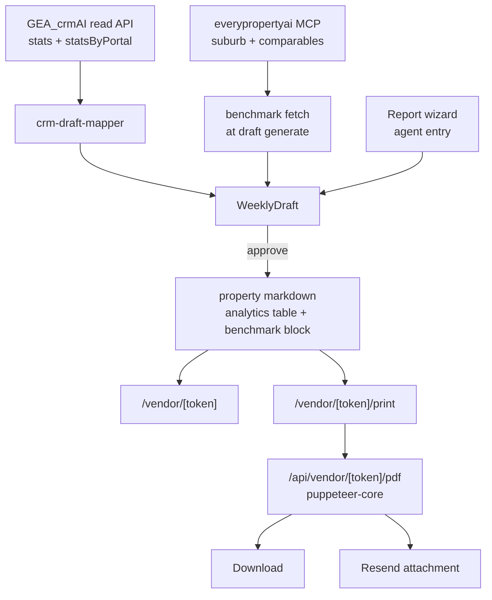
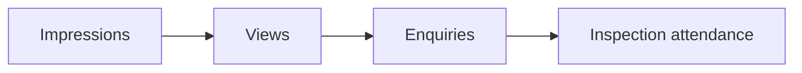

# feat: Ignite-grade vendor report data + real PDF download

**Created:** 2026-08-31
**Plan depth:** Standard

---

## Summary

The GEA vendor portal reports weekly REA/Domain views, enquiries and saves plus inspections. REA's Ignite vendor report carries a materially richer set: an activity funnel with impressions, benchmark comparisons against the suburb and price bracket, competing-listing context, and campaign product/spend visibility. This plan brings that data set into `/vendor/[token]` and replaces the current browser-print "Download PDF" with a real server-rendered PDF that can be attached to an email.

Two deliverables, one artifact: a widened weekly metric set surfaced in the existing portal, and a PDF endpoint that renders the same report server-side.

---

## Problem Frame

**Current state.** `AnalyticsRow` (`src/lib/markdown-loader.ts:69`) carries six numbers per week: REA views/enquiries/saves and Domain views/enquiries/saves. `AnalyticsDetail` adds `searchAppearances`, and `WeeklyDraft` (`src/lib/types.ts`) carries `reaSearchAppearances` / `domainSearchAppearances` — but neither reaches the vendor portal weekly table. There is no benchmark, no competing-listing context, no campaign spend, and no funnel view. `DownloadButton.tsx` calls `window.print()`, so there is no file to attach to a Resend email.

**Why it matters.** Vendors compare our report against the Ignite report their agent can also send. Bare counts with no benchmark are unreadable — "412 views" means nothing without "suburb median 260". The absent benchmark is the single biggest gap, not the absent fields.

**Scope note.** The Ignite report itself is behind an authenticated `invitationId` and could not be read directly (the share URL returns a JS shell only). The field set below is planned from the standard REA Ignite resi vendor-report shape and every field is flagged as an assumption in **Assumptions**. Field names and grouping should be reconciled against a real Ignite export before U2 ships.

---

## Assumptions

Each assumed to exist in the Ignite report; confirm against a real export before U2:

- **A1** — Funnel metrics: search impressions → listing views → photo/detail engagement → enquiries → inspection attendance.
- **A2** — Benchmarks are shown as *your listing vs suburb median vs price-bracket median*, for views and enquiries, over the campaign to date.
- **A3** — Competing listings: count of active comparable listings in the suburb/price band during the reporting week.
- **A4** — Campaign products and spend: which REA/Domain upgrade tiers ran (Premiere/Highlight/Feature), and the spend to date against budget.
- **A5** — Week-on-week deltas are shown as percentages against the prior week, not just raw counts.
- **A6** — Audience/buyer breakdown (e.g. saved-search vs browse origin) is present but low-value for GEA vendors; treated as out of scope.

---

## Requirements

- **R1** — The weekly report captures the extended metric set (A1–A5) per week, per portal, with the existing gap-vs-zero distinction preserved.
- **R2** — Extended metrics are optional. A week with only the current six fields must still render, unchanged, with no empty scaffolding.
- **R3** — The vendor portal surfaces the extended set: a funnel view, a benchmark comparison, competing-listing context, and campaign spend.
- **R4** — A vendor can download the report as a real PDF file from `/vendor/[token]`.
- **R5** — The same PDF can be generated server-side without a browser session, so it can be attached to a Resend email.
- **R6** — Benchmark values are labelled with their source and capture date; an absent benchmark hides the comparison rather than showing a placeholder.
- **R7** — No CRM write is introduced. This app stays read-only against `GEA_crmAI` except for the existing sent-report log.

---

## Key Technical Decisions

**KTD1 — Extend `AnalyticsRow` with optional fields rather than introducing a parallel "extended metrics" type.**
The markdown table is already the record of truth and `parseMarkdownTable` is header-driven, so extra columns parse for free and older files keep working. A second type means a second loader, a second writer and a merge at render time. Optional fields on the existing row give R2 for free.
*Rejected:* a separate `analytics/extended/` file per week — doubles the write path for no isolation benefit.

**KTD2 — Benchmarks come from the `everypropertyai` MCP (`vendor_report`, `on_market_listings`, `comparable_sales`), cached to markdown, not computed locally.**
GEA has no suburb-median view of its own and the CRM's read API (`src/lib/crm-client.ts`) exposes only per-listing stats. Computing a suburb median from GEA's own listings would be statistically meaningless at GEA's volume. The MCP already returns suburb and comparable data.
*Consequence:* benchmarks are fetched at draft-generation time and written into the property markdown alongside the week's row, so the portal render stays filesystem-only and fast (no MCP call on a vendor page view). This also satisfies R6's capture-date labelling.
*Rejected:* live-fetching benchmarks on portal render — puts a third-party dependency on the vendor's page load.

**KTD3 — PDF via headless Chromium rendering a dedicated print route, not a JS PDF builder.**
The portal's layout and design system already exist and `globals.css:145` already carries a print block. `puppeteer-core` pointed at a Chromium installed in the existing `Dockerfile` renders the real page; a `pdfkit`/`jsPDF` approach means rebuilding the entire report layout a second time and keeping two designs in sync forever.
*Consequence:* deployment must install Chromium in the image. Railway's Docker build already exists, so this is a Dockerfile line, not a platform change.
*Rejected:* keeping `window.print()` only — fails R5, cannot produce a file for Resend.

**KTD4 — The PDF renders a server-side print route (`/vendor/[token]/print`), guarded to loopback/internal calls, rather than screenshotting the live portal route.**
The portal page has client components (tickers, comment threads, tour) that are noise or nondeterministic in a PDF. A dedicated route renders the same data through the same components minus the interactive ones, and gives one place to tune pagination.

**KTD5 — Extended metrics are agent-entered or CRM-sourced; no new scraper.**
`crm-draft-mapper.ts` already maps `portal`/`metric` pairs into draft fields. New metrics extend that map. Where the CRM has no value, the field is a gap and the wizard collects it. Nothing in this plan calls REA or Domain directly.

---

## High-Level Technical Design

Data flow for one week's report:

The funnel is a derived view, not stored separately — it reads the stored counts in order:

Each step renders its own count plus the conversion rate from the prior step. Any step whose source metric is a gap collapses the funnel to the steps either side of it rather than showing a zero.

---

## Implementation Units

### U1. Widen the weekly metric shape

**Goal:** `AnalyticsRow`, the markdown analytics table, and `WeeklyDraft` carry the extended set as optional fields.

**Requirements:** R1, R2

**Dependencies:** none

**Files:**
- `src/lib/markdown-loader.ts` — `AnalyticsRow`, `parseAnalyticsTable`, `writeAnalyticsFile`, the table header constant near line 436 and the upsert header match near line 564
- `src/lib/types.ts` — `WeeklyDraft`
- `src/lib/__tests__/markdown-loader.test.ts` (create if absent)

**Approach:**
1. Add optional numeric fields to `AnalyticsRow`: `reaImpressions`, `domainImpressions`, `reaDetailViews`, `domainDetailViews`, `competingListings`, `campaignSpend`.
2. Extend the analytics table header constant with the matching columns; append only, never reorder — the upsert path matches on the header string.
3. Make `parseAnalyticsTable` return `undefined` (not `0`) for a column absent from the header, so a gap is distinguishable from a real zero per R1.
4. Widen `writeAnalyticsFile` to accept and emit the new columns when supplied.
5. Mirror the fields onto `WeeklyDraft` as optional.

**Patterns to follow:** the existing `parseInt(r['REA Views'] || '0', 10) || 0` idiom, adapted so absent-column yields `undefined`; `FieldSource`'s existing `gap` convention.

**Test scenarios:**
- Parsing a legacy six-column analytics table returns rows with the six known values and `undefined` for every new field.
- Parsing a widened table returns the new values as numbers.
- A widened table row containing a literal `0` in a new column parses as `0`, not `undefined`.
- `writeAnalyticsFile` called without extended fields emits the legacy header unchanged.
- Upserting a week into a file already containing that week replaces the row and preserves other rows.

**Verification:** existing markdown-loader tests pass unchanged; a fixture file written before this change still loads in the portal.

---

### U2. Reconcile the field set against a real Ignite export

**Goal:** confirm or correct A1–A5 before the UI hard-codes labels.

**Requirements:** R1

**Dependencies:** U1

**Files:** `docs/plans/2026-08-31-001-feat-ignite-grade-vendor-report-plan.md` (this file — update Assumptions in place)

**Approach:** Obtain a real Ignite resi vendor report (screenshot or PDF from the agent's Ignite account). For each of A1–A5, record the actual metric names, groupings and units. Where a planned field does not exist in Ignite, drop it from U1's shape before U3 renders it. Where Ignite carries a field this plan missed, add it to U1.

**Execution note:** this is a blocking check, not a code unit. Do it before U3 so labels are written once. If the export cannot be obtained, ship U3 with the assumed labels and record that decision here.

**Test expectation:** none — documentation reconciliation.

**Verification:** Assumptions section marked confirmed or corrected, with the source noted.

---

### U3. Benchmark fetch and storage

**Goal:** suburb and price-bracket benchmarks are captured at draft-generation time and stored in the property markdown with a capture date.

**Requirements:** R1, R6, R7

**Dependencies:** U1, U2

**Files:**
- `src/lib/benchmarks.ts` (new) — fetch + shape
- `src/lib/markdown-loader.ts` — read/write a `## Benchmarks` block in the property file
- `src/lib/weekly-drafts.ts` — call the fetch during draft generation
- `src/lib/__tests__/benchmarks.test.ts` (new)

**Approach:**
1. Define `Benchmark { metric, listingValue, suburbMedian, bracketMedian, capturedAt, source }`.
2. `benchmarks.ts` calls the `everypropertyai` MCP for the property's suburb and price band, and maps the response into `Benchmark[]`. Follow `crm-client.ts`'s contract exactly: server-only, typed result, never throws, degrades to an empty array.
3. Store as a `## Benchmarks` markdown table in the property `index.md`, parsed with the existing `parseMarkdownTable`.
4. Wire the fetch into draft generation next to the existing CRM enrich step; a failure leaves benchmarks absent and does not fail the draft.

**Patterns to follow:** `src/lib/crm-client.ts` for the never-throw typed-result client shape; `parseMarkdownTable` / `updatePropertySection` for the storage round-trip.

**Test scenarios:**
- A successful MCP response maps to `Benchmark[]` with `capturedAt` set.
- An MCP failure returns an empty array and does not throw.
- An unconfigured MCP returns empty without a network call.
- Round-tripping benchmarks through the markdown block preserves values and capture date.
- A property with no `## Benchmarks` section loads with an empty benchmark list.

**Verification:** generating drafts on a property with a known suburb writes a populated `## Benchmarks` block; generating with the MCP unreachable writes no block and the draft still generates.

---

### U4. Portal sections — funnel, benchmarks, competition, spend

**Goal:** `/vendor/[token]` renders the extended data, and hides each section cleanly when its data is absent.

**Requirements:** R2, R3, R6

**Dependencies:** U1, U2, U3

**Files:**
- `src/components/vendor/ActivityFunnel.tsx` (new)
- `src/components/vendor/BenchmarkComparison.tsx` (new)
- `src/components/vendor/CompetitionContext.tsx` (new)
- `src/components/vendor/CampaignSpend.tsx` (new)
- `src/app/vendor/[token]/page.tsx` — compose the sections
- `src/components/vendor/WeeklyTrend.tsx` — add week-on-week percentage deltas (A5)

**Approach:**
1. Each new component takes its data and returns `null` when the data is absent — the page composes unconditionally, the component decides. No conditional-render sprawl in `page.tsx`.
2. Funnel derives its steps from the stored counts; a gap step collapses rather than rendering zero.
3. Benchmark comparison shows listing vs suburb median vs bracket median with the capture date; renders nothing without a benchmark (R6).
4. Reuse the existing `EmptyState`, `SectionHeading`, `TrendBadge` and `StatCard` primitives — no new visual vocabulary.

**Patterns to follow:** `LiveStatsTile.tsx` and `WeeklyTrend.tsx` for section shape; `DESIGN.md` plus `~/.claude/GEA_DESIGN.md` for tokens. Read both before writing markup.

**Test scenarios:**
- Funnel with all steps present renders each count and the conversion rate between consecutive steps.
- Funnel with a gap mid-step renders the surrounding steps and no zero.
- Benchmark component returns `null` with an empty benchmark list.
- Benchmark component renders the capture date when benchmarks are present.
- A property whose markdown predates U1 renders the portal with no new sections and no layout break.
- Week-on-week delta shows a negative percentage correctly when the current week is lower than the prior week.
- Delta renders nothing when there is no prior week.

**Verification:** the portal for a legacy property is visually unchanged; the portal for a property with extended data shows all four new sections.

---

### U5. Server-rendered PDF

**Goal:** a real PDF file, downloadable from the portal and generatable server-side for email.

**Requirements:** R4, R5

**Dependencies:** U4

**Files:**
- `src/app/vendor/[token]/print/page.tsx` (new) — print-only render of the report
- `src/app/api/vendor/[token]/pdf/route.ts` (new) — renders the print route to PDF
- `src/lib/report-pdf.ts` (new) — the puppeteer call, reusable by the email path
- `src/components/vendor/DownloadButton.tsx` — point at the PDF endpoint
- `Dockerfile` — install Chromium
- `package.json` — add `puppeteer-core`

**Approach:**
1. `print/page.tsx` renders the same data as the portal through the same components, omitting the interactive ones (ticker, comment thread, tour, chat) and the header nav.
2. `report-pdf.ts` launches `puppeteer-core` against the container's Chromium, navigates to the print route on `localhost`, and returns a PDF buffer. Single shared browser instance where practical; a fresh page per request.
3. The API route resolves the token to a slug via `getPropertyTokenSlug`, calls `report-pdf.ts`, and streams the buffer with a `Content-Disposition` filename of `{address}-{weekEnding}.pdf`.
4. The print route rejects requests that are not loopback-originated or token-valid (KTD4) — it must not become an unauthenticated second read surface for a report.
5. `DownloadButton` becomes a link to the PDF endpoint with a pending state; drop `window.print()`.

**Execution note:** verify the Chromium launch inside the built Docker image, not just locally — a working local `puppeteer-core` against a system Chrome proves nothing about the deployed image. This is the unit's real risk.

**Test scenarios:**
- The PDF endpoint returns `application/pdf` with a non-empty body for a valid token.
- An unknown token returns 404, not a PDF of someone else's report.
- The filename header carries the address and week ending.
- The print route omits the interactive components present on the portal route.
- The print route rejects an external unauthenticated request.
- `report-pdf.ts` surfaces a launch failure as a typed error rather than hanging the request.

**Verification:** downloading from the deployed portal yields a PDF that opens and shows the full report including the U4 sections; the same buffer can be produced from a server-side call with no browser session.

---

### U6. Wizard and draft capture for the new fields

**Goal:** agents can enter the extended metrics, and CRM-sourced values pre-fill them.

**Requirements:** R1, R7

**Dependencies:** U1, U2

**Files:**
- `src/lib/crm-draft-mapper.ts` — extend the portal/metric map
- `src/components/ReportWizard.tsx` — extended fields on the portal-stats steps
- `src/app/api/weekly-drafts/[id]/route.ts` — accept the new fields in PATCH
- `src/lib/__tests__/crm-draft-mapper.test.ts`

**Approach:** Add the new `{ field, portal, metric }` entries to the existing map so CRM pre-fill and refresh cover them automatically, including the agent-edits-win behaviour. Add the fields to the wizard as optional inputs grouped with their portal's existing stats — leave blank means gap, not zero.

**Patterns to follow:** the existing map entries at `crm-draft-mapper.ts:24`; the existing `agentEdited` handling in `weekly-drafts.ts`.

**Test scenarios:**
- A CRM response containing a new metric populates the matching draft field with provenance.
- A CRM response missing a new metric leaves the field a gap, not zero.
- A refresh does not overwrite a new field the agent has edited.
- Submitting the wizard with an extended field blank stores a gap.

**Verification:** generate drafts against the CRM and confirm the new fields carry provenance where the CRM has data and gaps where it does not.

---

## Scope Boundaries

**In scope:** extended weekly metrics, benchmark capture and display, the four new portal sections, a real PDF download, wizard and CRM capture for the new fields.

### Deferred to Follow-Up Work
- Emailing the PDF via Resend — U5 makes the buffer available; wiring it into the send path is a separate unit.
- Rental / `/landlord/[token]` parity — the same shape applies but rentals use `RENTAL.md` and a different loader.
- Historical week browsing (existing TODO #5).

### Not doing
- A standalone public share link separate from `/vendor/[token]` — the existing token portal is the share surface.
- Buyer/audience demographic breakdown (A6) — low value for GEA vendors.
- Any direct REA or Domain API integration (KTD5).
- Any new CRM write (R7).

---

## Open Questions

- **Q1** — Can a real Ignite export be obtained for U2? If not, the assumed labels ship and get corrected later.
- **Q2** — Does the `everypropertyai` MCP return a price-bracket median, or only suburb-level? If suburb-only, the benchmark shows one comparison line rather than two.
- **Q3** — Is campaign spend (A4) known to the CRM, or is it agent-entered only? Affects whether U6 maps it or the wizard owns it outright.

---

## Risks & Dependencies

- **Chromium in the deploy image** (U5) — the largest operational risk. Adds image size and a launch failure mode. Mitigation: verify in the built image before merging; the endpoint returns a typed error so a launch failure degrades to a failed download, not a broken portal.
- **MCP availability** (U3) — benchmarks are a third-party dependency. Mitigated by capturing at draft time, not render time, and by the never-throw client shape.
- **Assumed field set** (U2) — mislabelled metrics are worse than absent ones for vendor trust. Mitigated by the U2 reconciliation gate.

---

## Verification Contract

- `npm run build` succeeds.
- `npx vitest run` passes, including the new tests in U1, U3, U5 and U6.
- A property whose markdown predates this work renders identically in the portal.
- A property with extended data shows the funnel, benchmarks, competition and spend sections.
- The PDF endpoint returns a valid PDF from the built Docker image.

## Definition of Done

R1–R7 are satisfied, U1–U6 are landed in dependency order, the Verification Contract passes, and the Assumptions section reflects the U2 reconciliation outcome.
